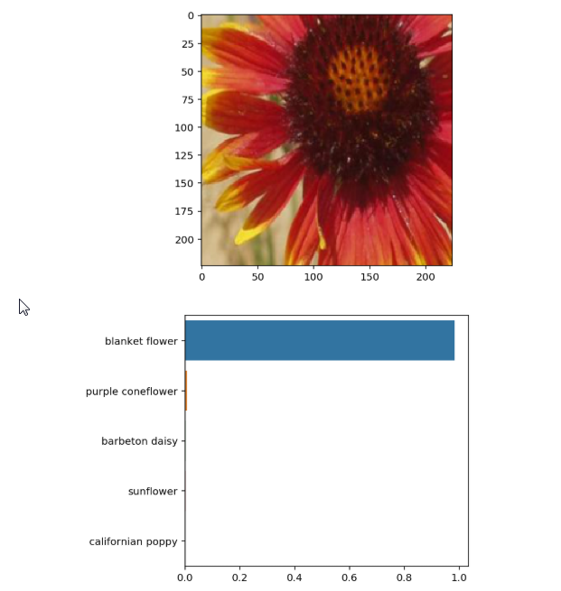

# Deep Learning - Image Classifier
In this project, an image classifier will be trained to recognize different species of flowers. Also, the project will be converted to a command line Python Application as well.  

The final results (top 5 probabilities) will be displayed as follow:  

## Algorithms used in the project
Pytorch's Very Deep Convolutional Networks for Large-Scale Image Recognition (VGG16) are used in this project.  

### Pre-Installation
Python 3.x , Jupyter Notebook, PyTorch, NumPy, Pandas, SciPy, matplotlib, seaborn.
